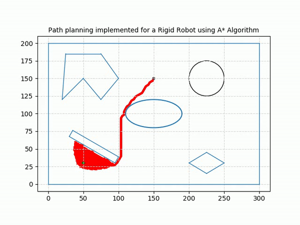

# Path Planning for Rigid Robot using A* Algorithm

 
## Authors
Nalin Das

## About
This is the  repository for the project - Path planning implemented for a Rigid Robot by making use of A* Algorithm. The algorithm is implemented on a 2D Grid Map of size 300x200.

## Dependencies
 - Python3
 - Numpy
 - matplotlib
 - math
 
## How to Run
1. Clone this repo or extract the "proj3p2_7_python.zip" file.  
2. Navigate to the folder "path-planning-rigid-robot-A-star-algorithm"  
3. To view the simulation video for the following parameters - 
Start : (50, 30, 60)
Goal : (150, 150)
Radius and clearance : 1 unit each
Step Size: 1 unit
Open the video "simulation.avi" 
4. To run the code, navigate to the "src" folder. From the terminal, run the command `python Astar_rigid.py`  
5. The program will ask for the clearance from the obstacles and then the radius of the robot, provide input in both cases in 'int' format. For eg: 3 
6. Next program will ask for start point, provide input in [x,y,theta] format. For eg: [20,30,30]. If the points provided are in the obstacle space or out of bounds, program will ask you to re-enter points. 
7. Next program will ask for goal point, provide input in [x,y,theta] format. For eg: [60,100,30].
If the points provided are in the obstacle space or out of bounds, program will ask you to re-enter points. 
8. You will then be asked the step size for each movement, provide input in 'int' format, For eg: 5  
9. You will then be asked the angle between each action, provide input in 'theta' format, For eg: 0,30,45 etc.  

The green circle is the Robot, and the black circle with no fill is the goal with threshold radius of 1.5. The red color is for the explored nodes, while the black color signifies the final path. 

